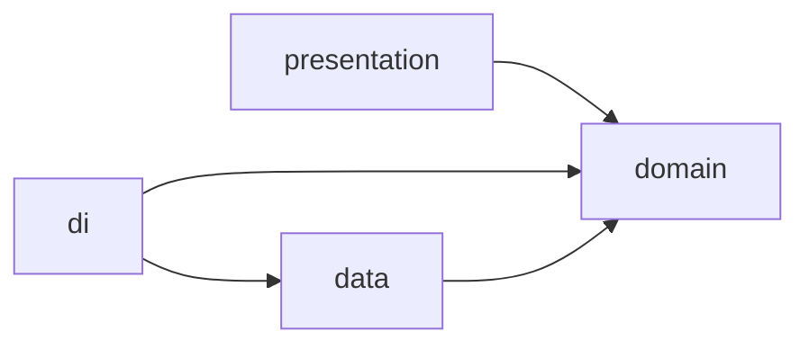

Readme · MD
# FilamentOS
 
**Stock, cost-per-print and sales tracker for 3D printing makers.**
 
Built with Flutter, Clean Architecture, Riverpod and GoRouter. Every structural decision is documented in [ADRs](docs/adr/).
 


<!-- CI badge goes here after the GitHub Actions workflow is added -->
 
## Why
 
I print and sell 3D-printed pieces. After a few months of doing it, three questions kept coming back: how much filament do I still have, how much did this piece really cost, and what should I charge for it? A spreadsheet answers them until the day you forget to update it.
 
FilamentOS registers the filament you buy, debits what each print uses, and calculates the cost of each piece from the fraction of each spool it consumed.
 
## What this project demonstrates
 
- **A domain that cannot hold invalid state.** Entities are created only through a validating `factory` over a private constructor, so a `Filament` in memory is always valid. See [`filament.dart`](lib/features/filaments/domain/filament.dart).
- **Value objects instead of raw numbers.** `Money` and `Weight` store integer minor units (cents, milligrams), so repeated sums never drift. Mixing currencies throws. See [ADR 0005](docs/adr/0005-value-objects.md).
- **A use case that never leaves partial writes.** [`RegisterPrint`](lib/features/prints/domain/register_print.dart) validates, then calculates, and only then persists. It also writes the print *before* the stock updates on purpose: without a transaction, the print is the event that can rebuild the stock, not the other way round. See [ADR 0002](docs/adr/0002-camadas-clean-architecture.md).
- **Errors the compiler checks.** Domain exceptions are a `sealed` hierarchy, so the UI maps every one of them to a message in an exhaustive `switch`. A new exception without a message breaks the build, not the screen.
- **Navigation decoupled from screens.** Screens navigate by route name, detail pages receive only an id, and the selected tab is derived from the URL. Deep links and unknown routes (404) work. See [ADR 0006](docs/adr/0006-navegacao.md).
- **Presentation rules out of the domain.** Language, unit, decimal separator and formatting live in `*Label` extensions in the presentation layer, never in the domain.
- **A hand-built design system.** Light and dark themes with color pairs from a `ThemeExtension`, instead of `ColorScheme.fromSeed`. See [ADR 0003](docs/adr/0003-design-system.md).
## Architecture
 
Feature-first folders, each split into layers:
 
```
lib/
├── core/          # router, theme, app shell, auth guard
├── shared/        # value objects, domain exceptions, shared labels
└── features/
    ├── filaments/
    │   ├── domain/        # entities, invariants, repository contracts
    │   ├── data/          # repository implementations
    │   ├── di/            # Riverpod providers that wire data to domain
    │   └── presentation/  # screens, screen state, labels
    ├── prints/
    ├── auth/
    ├── sales/
    └── dashboard/
```
 

 
The domain depends on nothing: no Flutter, no Firebase. Presentation and data both depend on it, and `di/` is the only place that knows which implementation is in use.
 
## Status and roadmap
 
This is a study project that grows session by session. Here is where it stands, honestly:
 
| Area | Status |
| --- | --- |
| Domain: `Filament`, `Print`, `Money`, `Weight`, `RegisterPrint` | Done, with unit tests |
| Navigation: routes, auth guard, 404, deep links | Done, with tests |
| Design system: light and dark themes | Done |
| Filament list and details, print history | Done, on sample data |
| Data layer | In-memory fake repositories ([ADR 0004](docs/adr/0004-repositorio-fake.md)) |
| Authentication | Contract defined; the app still uses a fake login |
| Firebase Auth and Firestore | Next: first real data layer |
| Forms to add filaments and register prints | Planned |
| Sales and dashboard | Planned (sales exists only as a domain entity) |
| Offline storage with Hive, internationalization | Planned |
 
Open work is tracked in [Issues](../../issues).
 
## Tech stack
 
| In use | Planned |
| --- | --- |
| Flutter, Dart 3 | Firebase Auth, Cloud Firestore |
| Riverpod (state and dependency injection) | Hive (offline storage) |
| GoRouter | intl (internationalization) |
| Equatable, Google Fonts | |
 
## Getting started
 
Requires Flutter 3.44 or later.
 
```bash
git clone https://github.com/felipepcmourao/filament_os.git
cd filament_os
flutter pub get
flutter run
```
 
The Firebase client configuration is committed on purpose: those keys identify the project and are not secrets. Access is controlled by security rules.
 
Run the checks:
 
```bash
flutter analyze
flutter test
```
 
## Tests
 
Unit tests cover the value objects (`Money`, `Weight`), the weight label, the `Filament` invariants and the `RegisterPrint` use case, including the failure cases that must not persist anything. Widget tests cover the filament list (with a fake repository injected through a provider override) and the router.
 
## Architecture decisions
 
Written in Portuguese, one per decision:
 
| ADR | Decision |
| --- | --- |
| [0001](docs/adr/0001-estrutura-de-pastas.md) | Feature-first folder structure |
| [0002](docs/adr/0002-camadas-clean-architecture.md) | Clean Architecture layers |
| [0003](docs/adr/0003-design-system.md) | Hand-built theme and domain colors isolated from presentation |
| [0004](docs/adr/0004-repositorio-fake.md) | Fake repositories before the real database |
| [0005](docs/adr/0005-value-objects.md) | Value objects for money and weight |
| [0006](docs/adr/0006-navegacao.md) | Declarative navigation, decoupled by route |
| [0007](docs/adr/0007-gerenciamento-de-estado.md) | State management with Riverpod |
 
## AI usage
 
I write the code and make the design decisions, using the official documentation as my main reference.
 
I use Claude to:
- Plan the study roadmap and break it into sessions
- Explain concepts behind each decision (architecture, invariants, testing)
- Review my code before I merge it
- Draft code comments, commit messages and pull request descriptions
About half of the commits carry `Co-Authored-By: Claude`. In those, the code is mine; the trailer marks that Claude drafted the commit message or comments, or reviewed the change.
 
The comment cleanup PRs (#3, #5, #9 to #13) were executed by Claude Code, following comment guidelines I set in `CLAUDE.md`, and I reviewed each one before merging. Those commits don't carry the trailer, so this section is the record of that work.
 
## Author
 
**Felipe Mourão**, self-taught Flutter developer based in Porto, Portugal.
[LinkedIn](https://www.linkedin.com/in/felipepcmourao/) · [GitHub](https://github.com/felipepcmourao)
 
## License
 
[MIT](LICENSE)
 
